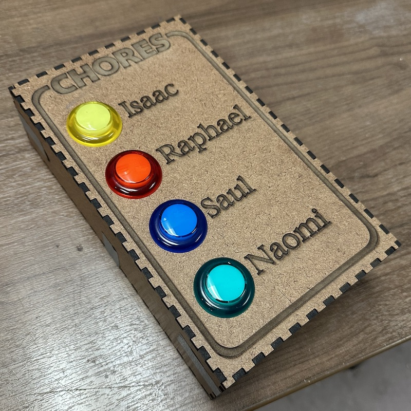

# CHORE-TRACKER v1.0.20240316

## Overview

This is a Python application that runs on a Raspberry Pi using a STEMMA-QT I2C interface to four arcade buttons.
The application can be configured to allow each button to have a different chores schedule.
When it is time for a button (owner) to do chores, the button will flash.
After 45 minutes of flashing, the button will flash faster.
If the button is pressed while flashing, it will become solid on indicating that chores are underway.
If the button is pressed while solid on, it will turn off reflecting that chores are complete.

## Installation

To install the application, ensure that the `INSTALL_DIR` is set appropriately in the `Makefile`.
Then, run:

    make install

This will copy the application to the specified directory and start it using `systemd`.

You can edit the `${INSTALL_DIR}/etc/config.json` appropriately so that the `syslog` logging reflects the button owners.
After editing the configuration file, you can restart the app using `systemd`:

    systemctl restart chore-tracker.service

## Creating a development environment

The application requires Python 3.
It also requires the python packages listed in the `requirements.txt` file.

You should set up a Python virtual enviroment to use when testing the application:

    python -m venv python-venv

With that created, you can install a local copy of the required packages:

    . python-venv/bin/activate
	pip3 install --no-cache-dir -r requirements.txt

After that, you can run the application manually.

    cd app
    python main.py

Unless your `etc/config.json` specifies `"sim_mode": true`, you should stop the `systemd` service before running.

    systemctl stop chore-tracker.service

## Assembly

This [Adafruit wishlist](http://www.adafruit.com/wishlists/589136) shows the materials that I used to create this project.
You will need to [enable I2C on your Raspberry Pi](https://learn.adafruit.com/adafruits-raspberry-pi-lesson-4-gpio-setup/configuring-i2c) using `raspi-config` if it is not already enabled.

I used the [Adafruit tutorial on the STEMMA-QT Arcade button controller](https://learn.adafruit.com/adafruit-led-arcade-button-qt) to get me familiar with the hardware and the I2C.

You can download the [SVG file I used to make this box](images/chore-tracker-box-1.0.svg).

## Issues and Enhancements

Issues and enhancments are being tracked on the [github chore-tracker project](https://github.com/nklein/chore-tracker/issues)
